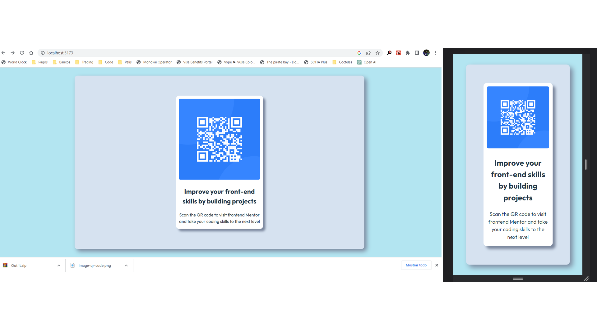

# Make It Real - QR code component
## This is a solution to the *QR code component in React* project of the Make It Real course.

## The challenge
create a QR code component using React

## Screenshot

## My process
### Built with
- Semantic markup using vscode editor
- React code using vite in vs code
- CSS properties in a stylesheet file
- Font Outfit

## What I learned
I learn and practice how to create React components

## Author
Juan David Peña  
github - @juandape  
email - juandavidp76@hotmail.com  

## Acknowledgments
Thanks to Make it Real to show me a path to become a better programmer